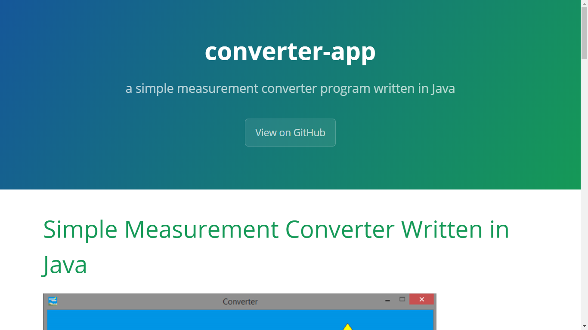
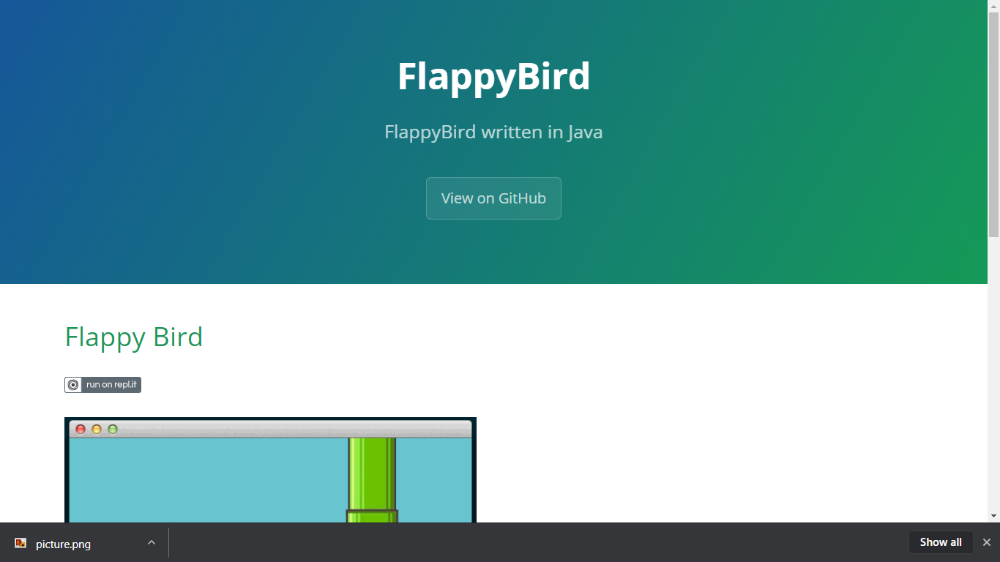

<!-- Global site tag (gtag.js) - Google Analytics -->

# Java Projects

When you are at GitHub, every subdirectory of this repo 
is a separate sample project that you can use 
if you have a similar project.

But when you are viewing this
right now as web page in `xdvrx1.github.io` domain,
you need to click `View on GitHub` to download the
source codes.

Thanks!

## Java Highlights
> - Java has an excellent reputation in web development.
>
> - Java has a good User Interface library, the Swing and JavaFX,
where you don't need to install external UI library for your programs.
>
> - Java has also an excellent reputation in network programming.
>
> - Java is excellent in modular programming through its `beans`.

## Subdirectories
And if you want to read the details of each subdirectory:

***

***

## Compiling
[Java Compile](https://xdvrx1.github.io/gists/gist_001/>)

## Contributing
1. Fork the repo!
2. Then, made changes and create a pull request.
3. If not fork, just please star this. Thanks! 

## License
MIT - the permissive license
